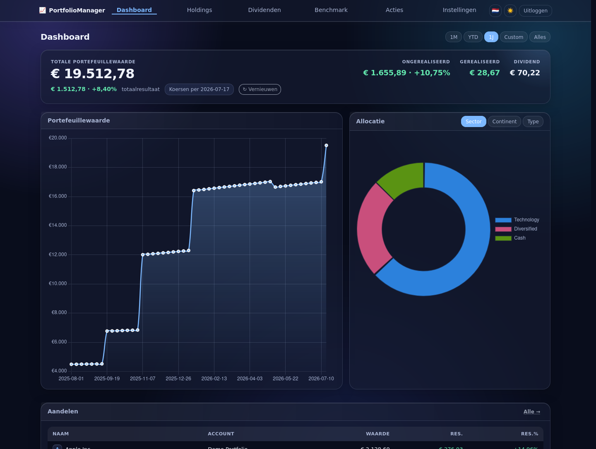
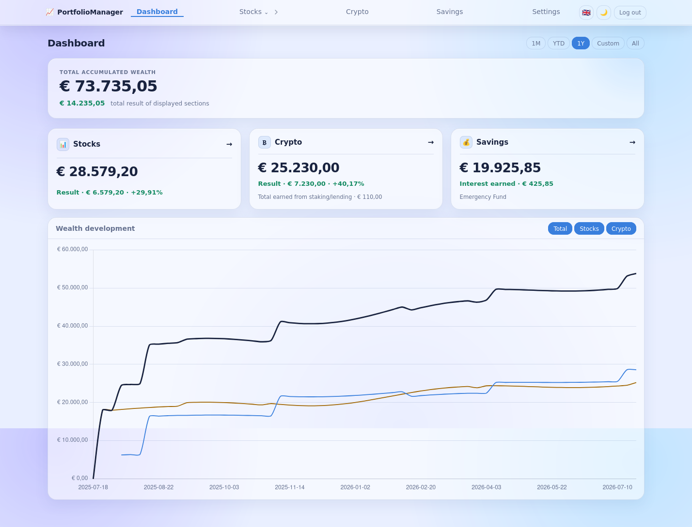
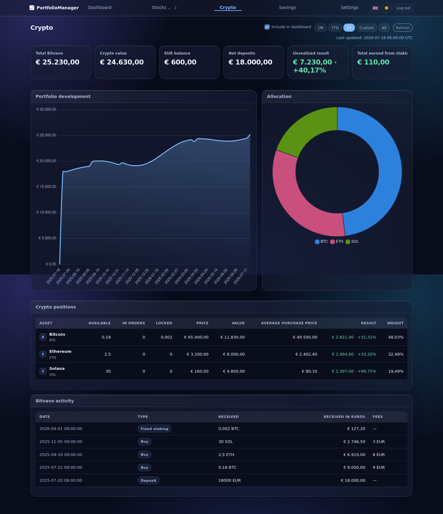
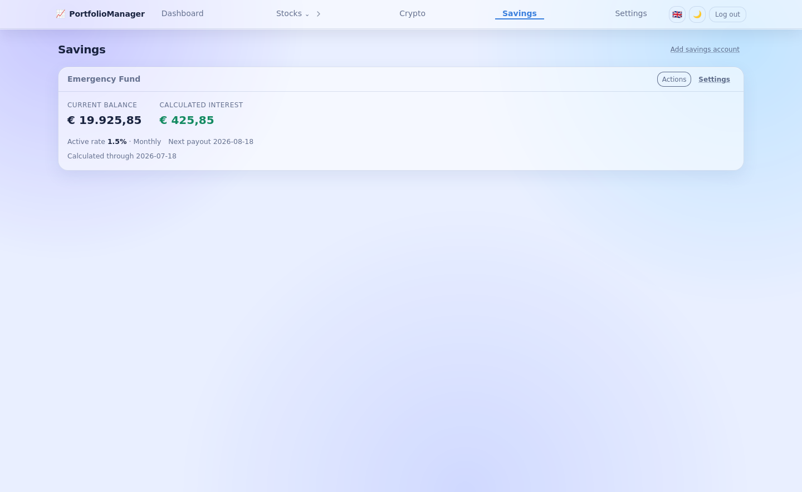

# PortfolioManager

PortfolioManager is a private, self-hosted wealth tracker for stocks, ETFs, crypto and savings. It imports DeGiro account exports, synchronizes a read-only Bitvavo account, calculates savings interest and brings the enabled categories together on one dashboard. Sign in with a password or a WebAuthn/FIDO2 security key.

It is designed for a small home server: one Python process, one SQLite database, no external database service, and no frontend build step.

## Quick start

Choose one of these two paths before you start:

| Path | Choose this when | Command |
|---|---|---|
| **Trusted LAN** | You want the simplest setup with a username and password, and the app stays on your private home network | `docker compose -f compose.lan.yml up -d --build` |
| **HTTPS (recommended)** | You use a reverse proxy, a domain, or want to use a YubiKey/passkey | `docker compose up -d --build` |

### Trusted LAN: the shortest route

```bash
git clone https://github.com/Sharpe-nl/PortfolioManager.git
cd PortfolioManager
docker compose -f compose.lan.yml up -d --build
docker compose -f compose.lan.yml logs
```

Open `http://SERVER-IP:8080`, copy the one-time setup token from the logs and create a username and password. Next, add a broker account and import its `Account.csv` export.

This intentionally uses unencrypted HTTP. Use it only on a network you trust, never expose port `8080` to the internet, and do not use it on public Wi-Fi. For HTTPS, YubiKeys/passkeys or a more detailed LXC/Proxmox installation, continue with [Deployment options](#deployment-options).

## Interface

<table>
  <tr>
    <td align="center"><strong>Dark theme</strong></td>
    <td align="center"><strong>Light theme</strong></td>
  </tr>
  <tr>
    <td></td>
    <td></td>
  </tr>
</table>

<table>
  <tr>
    <td align="center"><strong>Crypto overview</strong></td>
    <td align="center"><strong>Savings overview</strong></td>
  </tr>
  <tr>
    <td></td>
    <td></td>
  </tr>
</table>

The screenshots use an isolated demo portfolio with fictitious data.

## Features

- A configurable main dashboard with separate stock, crypto and savings cards
- A configurable history chart for stocks, crypto and optional savings, with 1D, 1M, YTD, 1Y, custom and all-time ranges
- DeGiro `Account.csv` imports with drag and drop, a built-in export guide and safe overlapping re-imports
- Broker, pension, savings and Bitvavo crypto accounts
- Stock and ETF holdings, value history, realised/unrealised P&L, dividends, actions and benchmark comparison
- Allocation by sector, continent and asset type, including manual ETF country weights
- Read-only Bitvavo integration with crypto balances, deposits, activity, historical EUR valuation and staking/lending income
- Savings accounts with dated deposits and withdrawals, rate history, payout frequency, optional end dates, rate tiers and manual interest corrections
- Configurable automatic stock and crypto refresh schedule (06:00 and 18:00 by default, using Europe/Amsterdam)
- Company, ETF and crypto logos through an optional Logo.dev publishable key; fetched assets are cached locally after the first request
- Optional username/password login with rate limiting, plus WebAuthn/FIDO2 authentication (YubiKey/passkey-compatible)
- SQLite backup download from the settings page
- Responsive liquid-glass interface for desktop and mobile

## Requirements

- A modern browser
- HTTPS and a stable hostname for WebAuthn in production (or the LAN mode below when using password login only)
- Outbound internet access for market prices, Bitvavo synchronization and optional Logo.dev images
- One of the deployment options below

The app stores all persistent state in `data/portfolio.db`. Do not commit or share this file: it contains portfolio data, the generated session secret, WebAuthn credentials, and encrypted external-service credentials. The generated encryption key is stored separately as `data/.credential_key`; keep it private as well.

See [SECURITY.md](SECURITY.md) for deployment hardening and private vulnerability reporting.

## Deployment options

| Option | Best for | Notes |
|---|---|---|
| Docker Compose | Most home servers | Easiest upgrades and a persistent named volume |
| Docker Compose LAN mode | A trusted home network with password login | One command; HTTP only, never expose it to the internet |
| Docker CLI | Existing Docker setup | Use your own reverse proxy and bind mount |
| Native systemd in an LXC | Proxmox users | Small footprint and straightforward backups |

In production, place the application behind a reverse proxy such as Caddy, Nginx Proxy Manager, Traefik, or nginx. Terminate TLS there and forward requests to the application. Do not expose the internal HTTP port directly to the internet.

### Choose a TLS setup

| Setup | Best choice when | Trade-off |
|---|---|---|
| Reverse proxy with a trusted certificate | You use a domain, or access the app from several devices | Recommended: browsers trust it automatically and WebAuthn works smoothly |
| nginx with your existing certificate | Your home server already runs nginx | One small proxy configuration is required |
| Self-signed certificate | A private LAN, one or a few devices, and no proxy | Fast to start, but every device must trust or accept the certificate |

For most home servers, use your existing Nginx Proxy Manager/nginx setup. A self-signed certificate is simpler on the server, but the browser warning and device trust step make it less convenient in daily use.

### Simple LAN mode (password login)

For a private home network, without a reverse proxy or certificates, use the dedicated LAN configuration:

```bash
git clone https://github.com/Sharpe-nl/PortfolioManager.git
cd PortfolioManager
docker compose -f compose.lan.yml up -d --build
```

Open `http://SERVER-IP:8080` and use the one-time setup token from `docker compose -f compose.lan.yml logs` to create a username and password. The app shows a persistent warning while LAN mode is active. This is the same route as the [Quick start](#quick-start) above.

This mode uses unencrypted HTTP. Only use it on a network you trust, do not create a router port-forward for `8080`, and do not use it on public Wi-Fi. Passkeys and YubiKeys need HTTPS, so use password login in LAN mode. You can later switch to [the normal Compose configuration](#option-1-docker-compose) or the self-signed setup; both use the same `portfoliomanager-data` volume.

## Option 1: Docker Compose

```bash
git clone https://github.com/Sharpe-nl/PortfolioManager.git
cd PortfolioManager
docker compose up -d --build
```

The included [compose.yml](compose.yml) binds the application to `127.0.0.1:8000` and stores data in the `portfoliomanager-data` Docker volume. Point your reverse proxy at `http://HOST:8000`.

Useful commands:

```bash
docker compose logs -f
git pull
docker compose up -d --build
docker compose down                 # keeps the data volume
```

To back up the database from the volume, use the backup button in Settings or copy it from a temporary container:

```bash
docker run --rm -v portfoliomanager-data:/data -v "$PWD":/backup alpine \
  cp /data/portfolio.db /backup/portfolio-backup.db
```

## Option 2: Docker CLI

```bash
git clone https://github.com/Sharpe-nl/PortfolioManager.git
cd PortfolioManager
docker build -t portfoliomanager:latest .
mkdir -p /srv/portfoliomanager/data
docker run -d \
  --name portfoliomanager \
  --restart unless-stopped \
  -p 127.0.0.1:8000:8000 \
  -v /srv/portfoliomanager/data:/app/data \
  -e PM_HTTPS_ONLY=true \
  portfoliomanager:latest
```

Chart.js and Pico.css are versioned in `app/static/vendor`, so the image build and application startup do not download frontend assets. The container runs as an unprivileged user and only needs write access to `/app/data`.

## Option 3: Native LXC / systemd (Proxmox)

This is a good fit for a Debian LXC container on Proxmox. A small starting point is 1 vCPU, 1 GB RAM and 8 GB disk.

```bash
apt update
apt install -y python3 python3-venv python3-dev git sqlite3

useradd --system --create-home --shell /usr/sbin/nologin service_portfolio_manager
git clone https://github.com/Sharpe-nl/PortfolioManager.git /opt/portfoliomanager

python3 -m venv /opt/portfoliomanager/.venv
mkdir /opt/portfoliomanager/data
chown -R service_portfolio_manager:service_portfolio_manager /opt/portfoliomanager/.venv /opt/portfoliomanager/data
sudo -u service_portfolio_manager /opt/portfoliomanager/.venv/bin/pip install -r /opt/portfoliomanager/requirements.txt

cp /opt/portfoliomanager/deploy/portfoliomanager.service /etc/systemd/system/
systemctl daemon-reload
systemctl enable --now portfoliomanager
```

The service listens on port `8443`. Configure the reverse proxy to reach the LXC IP on that port and forward `Host` and `X-Forwarded-Proto` headers. See [deploy/install.md](deploy/install.md) for a more detailed LXC and proxy guide.

PortfolioManager follows semantic versions. The current public beta is `0.1.0-beta.3`; see [CHANGELOG.md](CHANGELOG.md) for release notes.

### Optional updates from Settings

The **Settings → Updates** card can always check the installed version against
the official `main` branch. Installing an update from the app is optional and
disabled by default. For a native systemd installation, follow the narrowly
scoped setup in the [update procedure](deploy/install.md#update-procedure): it
permits the web-service account to start only the fixed
`portfoliomanager-update.service`, not to run arbitrary commands with `sudo`.
The updater verifies the official repository, requires a clean `main` checkout,
and keeps code and deploy scripts root-owned. Docker installations should use
their normal image update procedure instead.

## Reverse proxy and WebAuthn

WebAuthn needs a secure browser context. Use HTTPS in production and always access the application by the same hostname used when registering your security key.

Your proxy must forward at least:

```nginx
proxy_set_header Host $host;
proxy_set_header X-Forwarded-Proto $scheme;
proxy_set_header X-Forwarded-For $proxy_add_x_forwarded_for;
```

Keep `PM_HTTPS_ONLY=true` behind HTTPS. Use the dedicated `compose.lan.yml` configuration only when you explicitly choose trusted-LAN HTTP mode.

## Self-signed TLS without a reverse proxy

This option is useful on a trusted LAN. Pick a hostname you will keep using (for example `portfolio.home`) and create a certificate on the Docker host:

```bash
mkdir -p /srv/portfoliomanager/data/tls
openssl req -x509 -newkey rsa:4096 -nodes -days 3650 \
  -keyout /srv/portfoliomanager/data/tls/server.key \
  -out /srv/portfoliomanager/data/tls/server.crt \
  -subj "/CN=portfolio.home" \
  -addext "subjectAltName=DNS:portfolio.home"
chmod 600 /srv/portfoliomanager/data/tls/server.key
```

Then run the included self-signed Compose configuration:

```bash
docker compose -f compose.selfsigned.yml up -d --build
```

Open `https://portfolio.home:8443`. Add a local DNS entry for that hostname if necessary, then trust the certificate on each device before registering a security key. The certificate and database live in `/srv/portfoliomanager/data`; keep that directory private and back it up.

## First run and settings

1. Retrieve the one-time setup token from the application log (`docker compose logs` or `journalctl -u portfoliomanager`). Use it to register the first FIDO2/WebAuthn authenticator or to create the first username and password. To choose your own code instead, set `PM_SETUP_TOKEN` before the first start. Register a second key or password user from **Settings → Security & data** as a backup login method.
2. For stocks and ETFs, create a broker account and import DeGiro's `Account.csv` from **Stocks → Actions → Import**. Overlapping exports are safe: previously imported rows are recognized automatically.
3. For crypto, create a Bitvavo API key with **View/read-only permissions only**. Never enable trading or withdrawals. Add it through **Settings → Accounts → Crypto (Bitvavo)**, then start the first synchronization from the Crypto page.
4. For savings, create an account with type **Savings**. Open its settings to add deposits or withdrawals and define the applicable interest rates, payout frequency and optional balance tiers.
5. Use **Settings → Show on dashboard** to choose which stock, crypto and savings cards appear on the main dashboard. On the dashboard chart you can toggle the category series; savings starts disabled there by default.
6. Review the automatic refresh schedule in Settings. Stocks and crypto refresh at 06:00 and 18:00 by default in the configurable `Europe/Amsterdam` time zone. The application must be running at those times.
7. Optionally add a Logo.dev **publishable** key under **Settings → Company logo API keys**. Without one, the interface falls back to initials.
8. Download a backup from Settings after the first successful import or synchronization.

### What the results mean

- **Stocks** are calculated only from broker-account transactions, cash events and market prices. Crypto and savings deposits do not affect stock performance.
- **Crypto unrealised result** is the current Bitvavo account value minus net EUR deposits. Staking and lending rewards are reported separately using their historical EUR value when available.
- **Savings growth** contains calculated and manually corrected interest. Deposits and withdrawals change the balance but are not treated as investment growth.
- **Main dashboard total value** adds all enabled category values. Its result adds stock performance, crypto unrealised result and savings interest. In the chart, savings is available as an optional series and is off by default.

### Automatic refresh

The built-in scheduler checks once per minute and runs each configured time slot only once. A stock-provider failure does not prevent Bitvavo from refreshing, and vice versa. It uses the time zone selected in **Settings → Automatic refresh** (`Europe/Amsterdam` by default), independently of the operating system or container time zone.

## Backups and updates

Back up `data/portfolio.db` while the app is stopped, or use SQLite's backup command:

```bash
sqlite3 data/portfolio.db ".backup 'portfolio-backup.db'"
```

If you want a restored installation to retain encrypted Bitvavo credentials, also back up `data/.credential_key` and protect it like a password. A database-only backup remains usable, but you will need to enter the Bitvavo credentials again after restoring it.

For a new, empty installation, you can restore a downloaded database from **Settings → Database**. The app validates the SQLite backup before restoring it and only enables this action while there is no portfolio data, preventing accidental overwrites. Restart the app after restoring; copy `data/.credential_key` separately if you also want to retain Bitvavo credentials.

For a native installation, update with:

```bash
cd /opt/portfoliomanager
git pull
sudo -u service_portfolio_manager .venv/bin/pip install -r requirements.txt
systemctl restart portfoliomanager
```

For Docker, pull the latest source and rebuild the container with `git pull` followed by `docker compose up -d --build`. In trusted LAN mode, add `-f compose.lan.yml` to the Compose command. Database migrations run automatically at application startup.

## Documentation and support

The README is the current source of truth for installation, updates and security. The detailed [LXC/Proxmox guide](deploy/install.md) covers native systemd and reverse-proxy deployments. A GitHub Wiki can later hold screenshots or provider-specific walkthroughs, but installation and security instructions should remain in this repository so they are versioned with the code.

## Project layout

```text
app/          FastAPI application, templates, static assets and services
migrations/   Ordered SQLite migrations, applied automatically at startup
deploy/       systemd unit and detailed LXC deployment guide
scripts/      Deployment and maintenance utilities
data/         Local SQLite database (ignored by Git)
```

## License

Copyright © 2026 Ruben M. All rights reserved.

PortfolioManager is available for personal, non-commercial use under the
[PortfolioManager Personal Use License](LICENSE). Ownership and all
intellectual-property rights remain with the copyright holder; redistribution, resale,
sublicensing, and commercial use require prior written permission.
